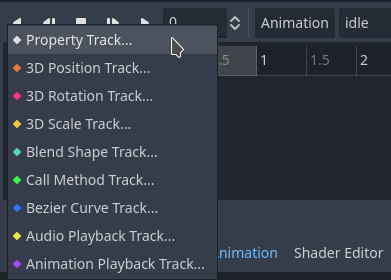

# Animacions bàsiques amb Godot

Continuem el tutorial anterior afegint animacions al nostre joc.

## Animació idle

La primera animació que crearem será la de *idle* (inactiu). Per a poder animar un sprite necessitem un node **AnimationPlayer**, l'afegim a l'escena Player:


Seleccionem el node AnimationPlayer  i anem al panell inferior, on seleccionem *Animation*. Crea una nova animació polsant el botó *Animation* i dona-li el nom *idle*:


Veuràs que t'ha afegit una línia de temps. Ara hem d'afegir la propietat que volem animar, afegint un nou *track* de tipus **Property Track**, seleccionem el node **Sprite2D** i, a continuació, **texture**:




Deixem la durada per defecte de 1 segon i afegim 2 punts d'animació a la línia de temps (botó dret -> *Insert key*). Activa també els botons *Autoplay on load* i *Animation Looping*:


Ara hem d'afegir els sprites als punts d'animació (*keys*). Selecciona el primer i arrossega *idle_01* al camp *Value* de l'inspector. Fes el mateix amb el segon punt i *idle_02*:


Executa el joc i veuràs com el teu personatge ja té la primera animació.

## Animació jump

Repeteix el mateix procediment per a l'animació de saltar, a la qual anomenarem *jump_up*. Aquesta animació no es repetirà en bucle, per tant no polsarem el botó *Animation Looping*. Pots usar la següent imatge com a referència dels temps:


Pots previsualitzar l'animació en la vista 2D, seleccionant l'escena *Player* i polsant el botó de *play*.

Una vegada tenim l'animació, la hem de poder cirdar des del codi de l'script de moviment, quan es polse el botó de saltar. Afegeix el seguent codi:

```lua
	# Get the input direction and handle the movement/deceleration.
	var direction = Input.get_axis("ui_left", "ui_right")
	if is_on_floor():
		velocity.x = direction * SPEED
		$AnimationPlayer.play("idle")

	# Handle jump.
	if Input.is_action_just_pressed("ui_up") and is_on_floor():
		velocity.y = JUMP_VELOCITY
		$AnimationPlayer.play("jump_up")
```

Amb aquest codi aconseguim que:

1. Quan estiga tocan el sòl (`is_on_floor()`), s'activará l'animació *idle* (`$AnimationPlayer.play("idle")`)
2. Quan es polse el botó de saltar, s'activarà l'animació *jump_up* (`$AnimationPlayer.play("jump_up")`)

## Animació crouch

Per a l'acció d'ajupir-se necessitarem 2 animacions, una per a ajupir-se i l'altra per a alçar-se (*crouch* i *stand*). Crea-les de la mateixa manera que les anteriors.

Al codi del nostre script hem d'afegir el codi necessari per a les animacions, baix del de *jump*. A més hem de crear una nova variable, `isCrouched`, que initcialitzem a `false` i que indicarà si el personatge està ajupit o no:

```lua
...
var isCrouched = false

...

func _physics_process(delta):

...

	#Crouch
	if Input.is_action_just_pressed("ui_down") and is_on_floor():
		$AnimationPlayer.play("crouch")
		isCrouched = true
	if Input.is_action_just_released("ui_down") and is_on_floor():
		$AnimationPlayer.play("stand")
		isCrouched = false
```

A més, modifiquem el codi del `if` del bloc de moviment, per a incloure la condició *isCrouched*, de manera que només puga moure's quan no està ajupit:

```lua
if !isCrouched and is_on_floor():
```

## Animació de caminar

Creem l'animació igual que abans, amb el nom *walking* i marcant l'execució en bucle.

Una vegada creada s'ha d'executar en lloc de la de *idle* quan estiga en moviment horitzontal (`velocity.x != 0`). Afegeix el següent codi dins del bloc de moviment:

```lua
if !isCrouched and is_on_floor():
	velocity.x = direction * speed

	if velocity.x != 0:
		$AnimationPlayer.play("walking")
	else:
		$AnimationPlayer.play("idle")
```

## Exercicis

1. Crea 2 animacions per al cop de puny, alçada i ajupida (*punch_stand* i *punch_crouch*).
2. Crea una acció d'entrada nova en *Project settings -> Input map*, anomenada *action_punch*. Afexeig com a *events* la tecla espai i el botó 0 del *joypad*.
3. Fes el codi necessari per a que s'execute l'animació apropiada amb el personatge alçat o ajupit (ajuda: crea una variable booleana, *isAttacking*, per a controlar quan el personatge està atacant)

## Bonus track

Veuràs que és dificil tornar el valor de *isAttaking* a `false`. Ho podem fer creant una funció pròpia que podem cridar al final de les nostres animacions d'atacar:

```lua
func endPunch():
	isAttacking = false 
```

Als tracks de les animacions d'atac, hem d'afegir un nou track de tipus *Call method track*, seleccionant el node **Player** i afegint una *key* amb el nom de la nostra funció, `endPunch()`:

