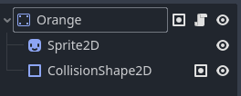
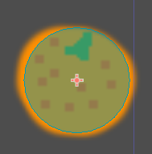

# Col·lisions amb Godot

En aquest tutorial utilitzarem col·lisions per a detectar quan un objecte entre en l'espai d'un altre objecte.

Afegirem a la nostra escena **Main** un objecte (en el nostre cas una taronja) que serà llançada contra el nostre personatge, el qual podrà destruir-la amb colps de puny. Si la taronja impacta contra el personatge, perdrà punts de vida.

## Objecte

Primer, creem una escena nova per a la taronja que llançarem, la qual serà de tipus **StaticBody2D** (li canviem el nom per ***Orange***), el qual tindrà dins un **Sprite2D** i un **CollisionShape2D**, aquest últim amb forma **CircleShape2D**:



Arrossega l'sprite *taronja.png* a l'espai **Texture** del Sprite2D i ajusta la forma de la CollisionShape2D a la del sprite:



La taronja entrarà en escena des de la dreta, així que arrossega l'escena *Orange.tscn* dins de l'escena *Main*, però fora del seu extrem dret.

Per a que la taronja es moga cap a l'esquerra, hem de crear un script:

```lua
extends StaticBody2D

@export var rotationVel = 5
@export var vel = 10

func _ready():
	pass
	

func _process(delta):
	rotate(-PI * delta * rotationVel)
	position.x -= vel + delta
```

En aquest script hem definit una velocitat de rotació i una velocitat de desplaçament, les quals usem en la funció `_process` per a que rote (`rotate(-PI * delta * rotationVel)`) i es desplace cap a l'esquerra (`position.x -= vel + delta`).

Si executem l'escena principal, la taronja s'hauria de desplaçar cap a l'esquerra fins a eixir de la pantalla. Com volem que torne a aparèixer per la dreta, hem de detectar que quan passe d'una certa coordenada **x**, canviar eixa coordenada **x** per una fora del límit dret. A més, volem que la posició vertical siga aleatòria, però dins de 3 possibles posicions: a l'altura del puny amb el personatge alçat, a l'altura del puny amb el personatge ajupit i a l'altura dels peus (per a que tinga que saltar el personatge).

Aquesta aleatorietat l'aconseguim amb un ***array***, que és una llista ordenada de variables. Cada element de l'array contindrà una coordenada **y**:

```lua
@export var positions = [250, 300, 350]
```

Per a accedir a cada element de l'array, hem d'indicar la seua posició (*índex*), sent la primera el 0, després el 1 i per últim el 2. Aixì, un array amb 10 elements tindria els índexs del 0 al 9.

```lua
# Exemple d'accés al primer element de l'array
print(positions[0])
```

Com nosaltres volem que cada posició soiga aleatòria, utilitzarem una funció per a generar un número enter entre 0 i 2. Modifiquem la nostra funció `_ready` per a que començe en una d'aquestes 3 coordenades:

```lua
func _ready():
	position.y = positions[randi_range(0, 2)]
```

També creem una funció, anomenada `respawn()`, que establirà les noves coordenades de la taronja:

```lua
func respawn():
	position.x = DisplayServer.screen_get_size().x + 50
	position.y = positions[randi_range(0, 2)]
```

> `DisplayServer.screen_get_size()` retorna les mides de la pantalla del nostre joc.

I cridem a la nostra funció `respawn()` dins de `_process`, quan passe de certa coordenada **x**:

```lua
func _process(delta):
	rotate(-PI * delta * rotationVel)
	position.x -= vel + delta
	
	if position.x < -50:
		respawn()
```

Ara a l'executar el nostre joc, quan la taronja ix per l'esquerra, hauria de tornar a aparèixer per la dreta.

## Exercicis

1. Ajusta els valors de velocitat de la taronja, així com les coordenades **x** i **y** de respawn.