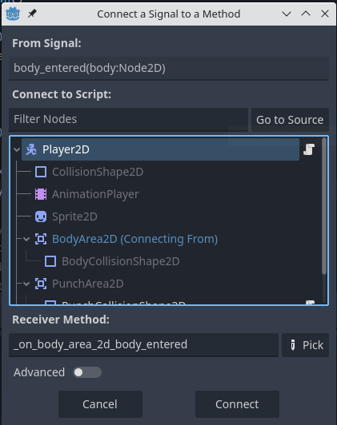

# Col·lisions amb Godot

En aquest tutorial utilitzarem col·lisions per a detectar quan un objecte entre en l'espai d'un altre objecte.

Afegirem a la nostra escena **Main** un objecte (en el nostre cas una taronja) que serà llançada contra el nostre personatge, el qual podrà destruir-la amb colps de puny. Si la taronja impacta contra el personatge, perdrà punts de vida.

## comportament de l'objecte

Primer, creem una escena nova per a la taronja que llançarem, la qual serà de tipus **StaticBody2D** (li canviem el nom per ***Orange***), el qual tindrà dins un **Sprite2D** i un **CollisionShape2D**, aquest últim amb forma **CircleShape2D**:


Arrossega l'sprite *taronja.png* a l'espai **Texture** del Sprite2D i ajusta la forma de la **CollisionShape2D** a la del sprite:


La taronja entrarà en escena des de la dreta, així que arrossega l'escena *Orange.tscn* dins de l'escena *Main*, però fora del seu extrem dret.

Per a que la taronja es moga cap a l'esquerra, hem de crear un script:

```lua
extends StaticBody2D

@export var rotationVel = 5
@export var vel = 10

func _ready():
	pass
	

func _process(delta):
	rotate(-PI * delta * rotationVel)
	position.x -= vel + delta
```

En aquest script hem definit una velocitat de rotació i una velocitat de desplaçament, les quals usem en la funció `_process` per a que rote (`rotate(-PI * delta * rotationVel)`) i es desplace cap a l'esquerra (`position.x -= vel + delta`).

Si executem l'escena principal, la taronja s'hauria de desplaçar cap a l'esquerra fins a eixir de la pantalla. Com volem que torne a aparèixer per la dreta, hem de detectar quan passe d'una certa coordenada **x** i canviar eixa coordenada **x** per una fora del límit dret. A més, volem que la posició vertical siga aleatòria, però dins de 3 possibles posicions: a l'altura del puny amb el personatge alçat, a l'altura del puny amb el personatge ajupit i a l'altura dels peus (per a que tinga que saltar el personatge).

Aquesta aleatorietat l'aconseguim amb un ***array***, que és una llista ordenada de variables. Cada element de l'array contindrà una coordenada **y**:

```lua
@export var positions = [290, 350, 400]
```

Per a accedir a cada element de l'array, hem d'indicar la seua posició (*índex*), sent la primera el 0, després el 1 i per últim el 2. Aixì, un array amb 10 elements tindria els índexs del 0 al 9.

```lua
# Exemple d'accés al primer element de l'array
print(positions[0])
```

Com nosaltres volem que cada posició siga aleatòria, utilitzarem una funció per a generar un nombre enter entre 0 i 2. Modifiquem la nostra funció `_ready` per a que començe en una d'aquestes 3 coordenades:

```lua
func _ready():
	position.y = positions[randi_range(0, 2)]
```

> La funció del sistema `randi_range(from, to)` genera un nombre enter entre `from` i `to`, ambdós inclosos.

També creem una funció, anomenada `respawn()`, que establirà les noves coordenades de la taronja:

```lua
func respawn():
	position.x = DisplayServer.screen_get_size().x + 50
	position.y = positions[randi_range(0, 2)]
```

> `DisplayServer.screen_get_size()` retorna les mides de la pantalla del nostre joc.

I cridem a la nostra funció `respawn()` dins de `_process`, quan passe de certa coordenada **x**:

```lua
func _process(delta):
	rotate(-PI * delta * rotationVel)
	position.x -= vel + delta
	
	if position.x < -50:
		respawn()
```

Ara a l'executar el nostre joc, quan la taronja ix per l'esquerra, hauria de tornar a aparèixer per la dreta.

## Col·lisions amb el personatge

En el nostre tutorial anem a crear 2 esdeveniments de col·lisió:

- Quan la taronja entre en contacte amb el cos del personatge, es produirà una col·lisió que farà que aquest perda vida i la taronja desaparega.
- Quan el personatge li pegue un colp de puny a la taronja, aquesta desapareixerà.

Per a crear aquest comportament, hem de crear en l'escena **Player** un nou node de tipus **Area2D** amb el seu corresponent **CollisionShape2D** per al *collider* del cos, també un altre Area2D per al collider del puny. Els reanomenem com en la imatge:


Creem les formes dels *CollisionShape2D* de forma rectangular i les ajustem com en la imatge (nota: ajusta el nou *collider* del cos per a que siga un poc més ample que el *collider* existent, utilitzat per a que el personatge tinga col·lisions físiques):


Pots canviar els colors dels colliders per a diferenciar-los.

Per a detectar la taronja, hem de introduir-la en un grup: selecciona l'escena **Orange** i, en el panell dret, pestanya *Node -> Groups*, crea un nou grup anomenat **Orange**:


Al crear el nou grup, marquem l'opció ***Global***:


Ara selecciona el node principal de l'escena **Orange** i marca el grup **Orange** en el panell de grups.

Obrim l'script de orange per a afegir una nova funció per a destruir la taronja quan col·lisione amb el personatge. Aquesta funció té 2 instruccions:

1. Fa invisible la taronja
2. Crida a la funció *respawn*, que farà que la taronja torne a aparèixer a la part dreta:

```lua
func destroy():
	visible = false
	respawn()
```

També hem d'afegir una instrucció a *respawn* per tal de que torne a ser visible:

```lua
func respawn():
	visible = true
	position.x = DisplayServer.screen_get_size().x + 50
	position.y = positions[randi_range(0, 2)]
```

Tornem a l'escena **Player**, seleccionem el node **BodyArea2D** i, al panell *Node -> Signals*, fem doble clic al senyal **body_entered(body: Node2D)**:


Ens pregunta a quin script volem connectar el senyal, elegim el node **Player**:



> Els **senyals** (*signals*) són missatges que emeten els nodes quan els passa alguna cosa específica, com que es pressiona un botó o entren en un àrea. Altres nodes poden connectar-se a aquest senyal i cridar a una funció quan passe l'esdeveniment.

Aquesta última acció ens haurà creat una nova funció al nostre script anomenada ***_on_body_area_2d_body_entered***. Borrem la instrucció `pass` i completem el seu codi:

```lua
func _on_area_2d_body_entered(body: Node2D) -> void:
	if body.is_in_group("Orange"):
		body.destroy()
		life -= 10
		print("Life: ", life)
```

Aquest codi comprova que el paràmetre `body` estiga en el grup *Orange*: si `body` és la nostra taronja, entrarà en el `if` i cridarà a la funció `destroy()` que hem creat en l'script de la taronja. Després resta una quantitat de la variable `life` i, per últim, executa les animacions corresponents a si està en peu o ajupit (hauràs de crear aquestes animacions si no les tens).

Per a que funcione aquest codi, hauràs de crear també una variable gobal (a l'inici de l'script), `life`, que serà el comptador de vida del nostre personatge:

```lua
@export var life = 100
```

Comprova que, cada vegada que la taronja colpeja el personatje, aquest perd 10 punts de vida i la taronja desapareix.

## Col·lisions amb el puny

Ara anem a configurar el *collider* del puny. Anem al node **AnimationPlayer2D** de l'escena **Player** i obrim l'animació *punch_stand*. La parem en el frame en el que està amb el puny estés i ajustem la forma del *collider* al puny:


Apunta les coordenades `x` i `y` del *collider*.

Ara afegim un script al node **PunchCollisionShape2D** i l'editem per a que quede així:

```lua
extends CollisionShape2D

# Called when the node enters the scene tree for the first time.
func _ready() -> void:
	disabled = true

# Habilita el collider en les posicions x i y
func enableCollider(x, y):
	position.x = x
	position.y = y
	disabled = false
	
# Deshabilita el collider
func disableCollider():
	disabled = true
```

El que fem amb l'script és:

- Deshabilitem el *collider* a l'inici, en la funció `_ready()`. Així no col·lisionarà amb la taronja.
- Creem una funció, `enableCollider(x, y)`, que torna a habilitar el *collider* en les coordenades `x` i `y`, passades com a arguments. Cridarem a aquesta funció quan l'animació estiga en el *frame* del colp de puny.
- Creem una funció, `disableCollider()`, que deshabilita el *collider*. Cridarem a aquesta funció quan passe el *frame* de l'animació del colp de puny.

A continuació, hem de cridar a les funcions `enableCollider` i `disableCollider` des del **Animator**: en l'animació *punch_stand*, afegeix un nou track: *Add track -> Call Method Track -> PunchCollisionShape2D*.


Afegim una key en el moment en que comença el *frame* del puny i cridem a la funció `enableCollider` amb les coordenades que has apuntat anteriorment. Fem el mateix amb la funció `disableCollider` en el moment en que termina el colp de puny de l'animació:


L'últim pas consisteix en enviar un senyal quan la taronja entre en el *collider* i tractar-la en l'script. Seleccionem **PunchArea2D** i en *Node -> Signals* afegim un nou senyal associat a l'script de **PunchCollisionShape2D**:


Ens haurà creat la funció `_on_punch_area_2d_body_entered` en l'script del *collider*. L'únic que hem de fer és cridar a la funció `destroy()` de la taronja quan detecte que ha col·lisionat amb un objecte del grup **Orange**:

```lua
func _on_punch_area_2d_body_entered(body: Node2D) -> void:
	if body.is_in_group("Orange"):
		body.destroy()
```

Ara el nostre personatge ja hauria de poder destruir les taronges amb colps de puny.

## Exercicis

1. Ajusta els valors de velocitat de la taronja, així com les coordenades **x** i **y** de respawn.
2. Fes 2 animacions per a quan el personatge reba un colp, *high_damage* (en peu) i *crouch_damage* (ajupit). Executa les animacions quan la taronja col·lisione amb el personatge, dins de *_on_area_2d_body_entered*.
3. Fes l'activació del *collider* per a l'animació *punch_crouch*.
4. Crea una variable global anomenada *score* que s'incremente cada vegada que el jugador colpeja una taronja amb el puny.
