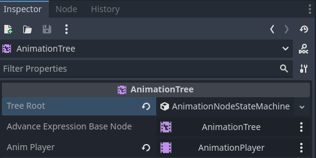
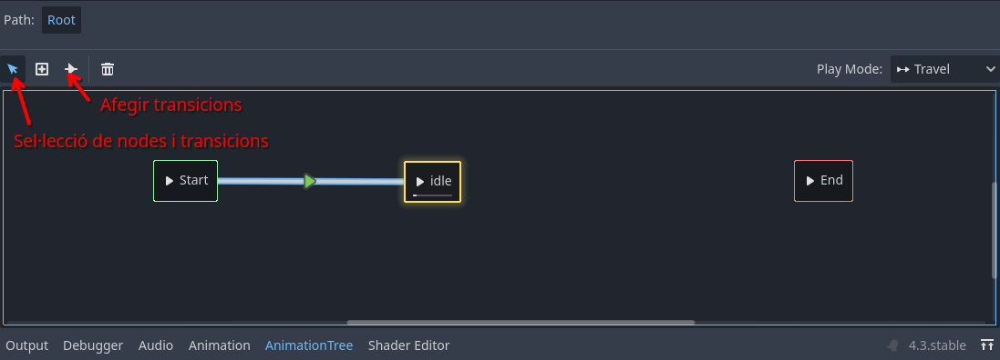
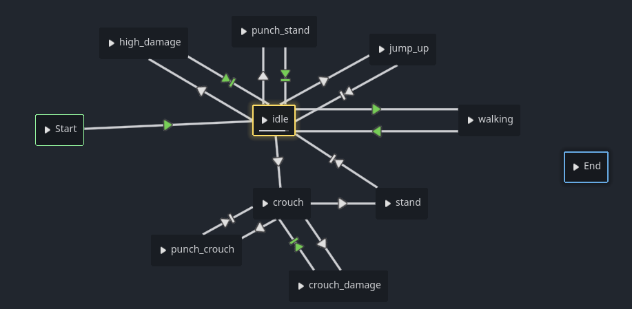
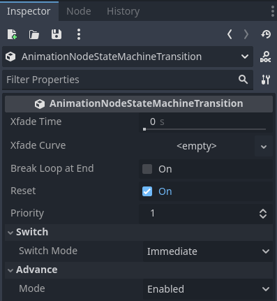
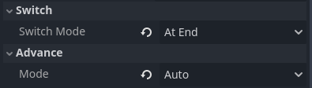
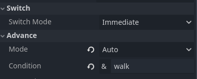

# Animation Tree

En aquest tutorial utilitzarem el node `AnimationTree` per a crear un arbre com a màquina d'estats per a gestionar millor les nostres animacions.

En primer lloc afegim un nou node de tipus **`AnimationTree`** a l'escena **Player**. 

Una vegada afegit, seleccionem el nou node i, a l'inspector, afegim a *Tree root* un nou **AnimationNodeStateMachine**. Per últim arrosseguem el nostre node **AnimationPlayer** a la propietat *Anim player* de l'inspector:



Al panell inferior, seleccionem *AnimationTree*, i afegim l'animació idle: botó dret del ratolí *-> Add animation -> idle*. Després afegim una transició des de *Start* a *idle*:



Afegim totes les animacions del nostre Animation Player de manera que queden com en la imatge:



Ara anem a configurar les transicions.

Les transicions que no volem que s'executen automàticament, les hem de tindre en *Switch mode: Immediate* i *Advance mode: Enabled*:



Aquestes transicions són les que es representen amb una fletxa blanca simple en el diagrama d'estats.

Les animacions que volem que passen a una altra quan finalitzen, les hem de configurar amb *Switch mode: At End* i *Advance mode: Auto*:



En el diagrama són les que tenen una fletxa verda amb una línia en la punta (de *punch_stand* a *idle*, per exemple).

Per a passar a una animació no automàtica, per exemple de *idle* a *jump_up*, hem de *viatjar* fins a eixa animació per codi en l'script.

Primer, en la zona de variables globals, creem una variable per a l'*animation tree* i una altra per a l'estat actual de l'*animation tree*:

```lua
@onready var anim_tree = $AnimationTree
@onready var anim_state = anim_tree.get("parameters/playback")
```

Després, en el codi, podem usar l'instrucció `anim_state.travel` per a passar a qualsevol animació:

```lua
#Jump
if Input.is_action_just_pressed("ui_up") and is_on_floor():		
    velocity.y = jump_speed
    anim_state.travel("jump_up")
```

Per a les animacions *At End* no cal que les cridem per codi, ja que faran la transició en finalitzar l'animació.

Una altra forma de cridar a una animació és configurar la transició amb *Switch mode: Immediate*, *Advance mode: Auto* i establint una *Condition* que serà una variable booleana (`true`/`false`). Per exemple, per a passar de *idle* a *walk*, configurem la transició així:



En aquest exemple, *walk* és la nostra variable booleana. Fariem el mateix per a passar de *walking* a *idle*, creant una variable amb nom *idle*.

Ara hem de donar-li un valor a *walk* en el codi, que en el nostre cas será el resultat de `velocity.x != 0` (serà `true` quan `velocity.x` no siga 0):

```lua
#Movement
var direction = Input.get_axis("ui_left", "ui_right")
if !isCrouched and !isAttacking and is_on_floor():
    velocity.x = direction * speed
    anim_tree.set("parameters/conditions/walk", velocity.x != 0)
    anim_tree.set("parameters/conditions/idle", velocity.x == 0)
```

