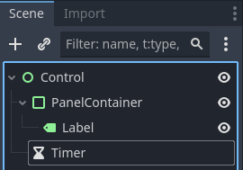
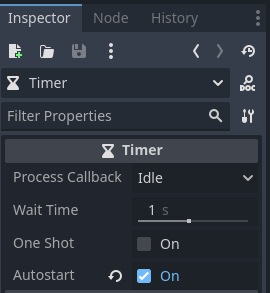
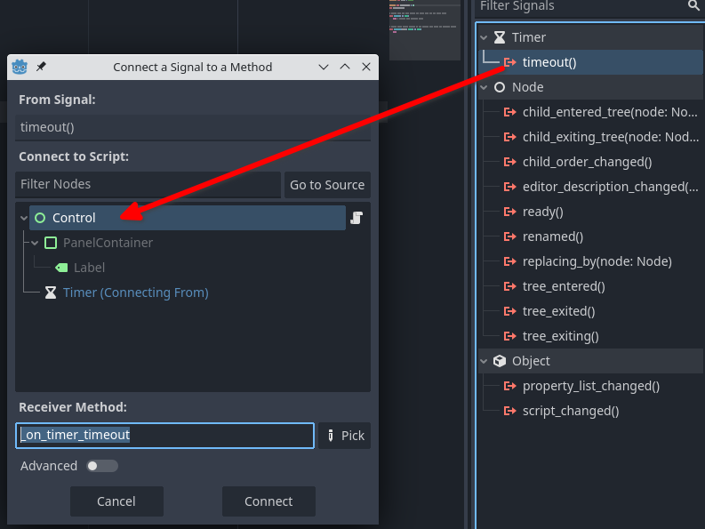

# Timer

En aquest tutorial utilitzarem el node `Timer` per a crear un comptador de temps descendent.

Creem una nova escena de tipus **User Interface**. Dins del node principal (*Control*), afegim un node de tipus **PanelContainer** i, dins d'aquest, una etiqueta (*label*). Per últim, creem un node de tipus **Timer** directament dins del node arrel (*Control*). L'arbre de l'escena quedaria així:



En l'escena, expandeix el panell fins que ocupe tot el *viewport* (pantalla visible).

Selecciona el node Timer, la configuració a l'Inpector ha de ser:



Amb aquesta configuració el *timer* començarà automàticament i durarà un segon.

Afegeix un script al node arrel. En aquest script primer creem variables per als nodes **Label** i **Timer** (pots arrossegar des del panell de l'escena els nodes per a obtindre el nom correcte):

```lua
extends Control

@onready var timerLabel = $PanelContainer/Label
@onready var timer = $Timer
```

També creem un parell de variables per al temps inicial i per al temps restant:

```lua
@export var initialTime = 5
var remainingTime
```

Abans de continuar amb l'script, selecciona el node **Timer** i crea un senyal per a `timeout()`, associant-lo al node arrel:



Ja podem terminar l'script. En la funció` _ready()`, reemplaça `pass` per:

```lua
func _ready() -> void:
	remainingTime = initialTime
```

Amb això estem assignant a la variable `remainingTime` el valor inicial de `initialTime`.

El cos de la funció `_process` el deixem així:

func _process(delta: float) -> void:
	timerLabel.text = str(remainingTime)

és a dir, fiquem en el text de l'etiqueta el valor de `remainingTime`. Això mostrarà el temps restant.

> La funció `str(number)` converteix el valor numèric *number* en una cadena de text (*string*).

Finalment, la funció `_on_timer_timeout()` serà l'encarregada de, cada vegada que finalitze el temps del *timer* (que hem configurat en 1 segon), comprove que `remainingTime` és major de 0 i, en tal cas, decrementar `remainingTime` en 1 i tornar a posar en marxa el comptador (`timer.start()`):

```lua
func _on_timer_timeout() -> void:
	if remainingTime > 0:
		remainingTime -= 1
		timer.start()
```

Executem l'escena i podem comprovar com es fa un compte enrrere des del valor inicial fins a 0.