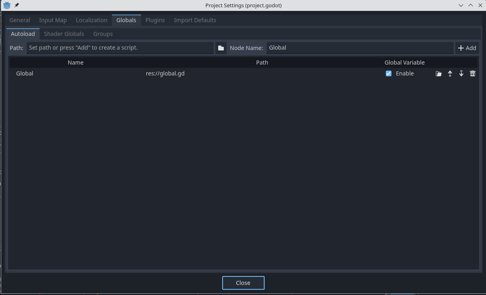

# Paràmetres globals

En Godot podem crear scripts globals amb paràmetres o funcions que poden servir per a:

- Mantindre configuracions entre escenes: volum de música, nivell de dificultat, nom del jugador, etc.
- Funcions que puguen ser utilitzades en totes les escenes.
- Passar paràmetres entre escenes.

Per a crea un script global, vés a *Project -> Project settings -> Globals*. Escriu el nom de l'script en *Node name* (per exemple *Global*) i afegeix-ho amb *Add*:



L'script s'haurà creat a l'arrel del sistema de fitxers del joc, amb el nom global.gd. Obri-ho i afegeix les variables i funcions que vols que estiguen accessibles des de qualsevol part del joc. Al nostre exemple, afegim una variable amb el nom value i el valor "example":

```lua
extends Node

var value = "example"
...
```

Per a accedir a la variable des d'un altre script, per exemple en el de player, hem d'importar primer l'script en la zona de variables globals de l'script:

```lua
@onready var global = $"/root/Global"
```

Amb el nom global podem modificar i llegir els valors de les variables definides en l'script global:

```lua
func _ready() -> void:
	global.value = "accessed" # Modifiquem value
	print(global.value) # Llegim i imprimim el valor de value
```