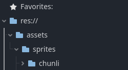
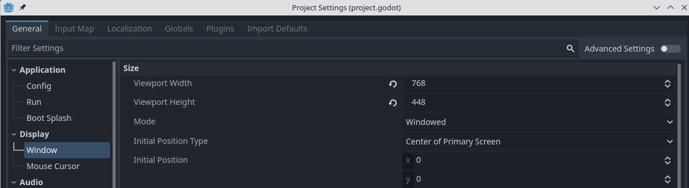
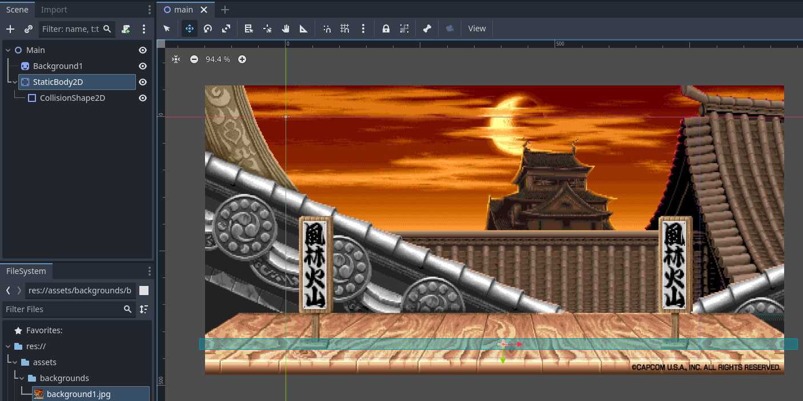
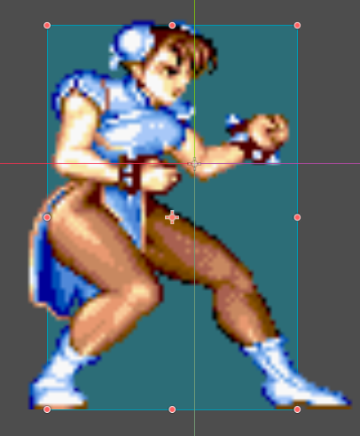
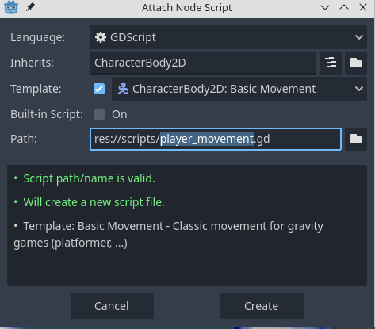

# Moviment bàsic amb Godot

En aquest tutorial anem a fer el moviment bàsic d'un personatge en un joc de lluita 2D, estil Street Fighter, encara que també pot servir per a qualsevol joc de plataformes 2D.

## Importació dels assets i creació de l'escena principal

En primer lloc crea, al panell *filesystem*, una carpeta anomenada **assets** i, dins, una altra carpeta anomenada **sprites** i, dins, una altra anomenada **chunli**:



Importa els sprites de Chun Li dins de la carpeta *chunli* i un dels fons dins de la carpeta *sprites* (també pots crear una carpeta anomenada *backgrounds* per a guardar els fons).

Ajustem la resolució del viewport del joc en el menú *Project -> Project Settings -> Display -> Window*: 768 x 448:



Ara creem una nova escena: **2D Scene**, i li canviem el nom a **Main**. Guarda-la (*CTR+S*), dins d'una carpeta anomenada **scenes**.

Arrossega el fons des del *filesystem* a l'escena i ajusta la seua posició i mida.

Crea un nou node de tipus **StaticBody2D** i dins un altre de tipus **CollisionShape2D**. Reanomena el StaticBody2D a **Floor**. Canvia la forma (*shape*) del CollisionShape2D a rectangular i ajusta'l per a tinga forma rectangular. Mou el node Floor a baix de l'escena per a que siga el sòl:



## Player

Crea una nova escena de tipus **CharacterBody2D** i canvia-li el nom a **Player**. Crea dins un node **CollisionShape2D** i un altre **Sprite2D**.

Per a l'sprite usarem la imatge *idle_01.png*. Arrossega-la a la propietat *Texture*.

Fes el CollisionShape2D rectangular i ajusta'l per a que tinga la forma aproximada del sprite.



Per últim, arrossega l'escena Player dins de l'escena Main, veuràs el personatge en la pantalla principal. Ajusta la seua mida al doble de la original (escena *Player -> Inspector -> Transform -> Scale*: 2)

## Script de moviment bàsic

Crea un script nou per a l'escena *Player* (recorda de fer-ho en l'escena original, no en la que has importat a *Main*)



Comprova que la funcionalitat bàsica de l'script funciona: vés a l'escena Main i executa-la (fixa aquesta escena com a la principal del joc). El personatge hauria de moure's d'esquerra a dreta amb els cursors.

Modificarem l'script per a que siga més configurable i adequat a les nostres necessitats:

```lua
extends CharacterBody2D

@export var SPEED = 300.0
@export var JUMP_VELOCITY = -400.0

var gravity = ProjectSettings.get_setting("physics/2d/default_gravity")

func _physics_process(delta):
	# Add the gravity.
	velocity.y += gravity * delta
	
		# Get the input direction and handle the movement/deceleration.
	var direction = Input.get_axis("ui_left", "ui_right")
	velocity.x = direction * SPEED

	# Handle jump.
	if Input.is_action_just_pressed("ui_up") and is_on_floor():
		velocity.y = JUMP_VELOCITY
	
	#Flip horizontally
	if direction != 0:
		scale.x = scale.y * direction

	move_and_slide()
```

Les modificacions que hem fet són:

1. Convertir les constants `SPEED` i `JUMP_VELOCITY` en variables amb l'anotació `@export`, d'aquesta manera les podem modificar en el inspector.
2. Importem el valor de gravetat des de *settings*.
3. Voltegem horitzontalment l'script del personatge.

## Exercicis

1. Crea 2 **StaticBody2D** amb *colliders* als límits laterals de l'escena, per tal que el personatge no s'en isca.
2. Ajusta els valors de moviment, salt i gravetat per a que done la sensació de jugabilitat desitjada.
3. Arrodoneix cap a dalt amb la funció [ceil](https://docs.godotengine.org/en/3.0/classes/class_@gdscript.html#class-gdscript-ceil) en el càlcul de `scale.x` en el codi de voltejar horitzontalment l'sprite (modificació necessària si usem un gamepad analògic).